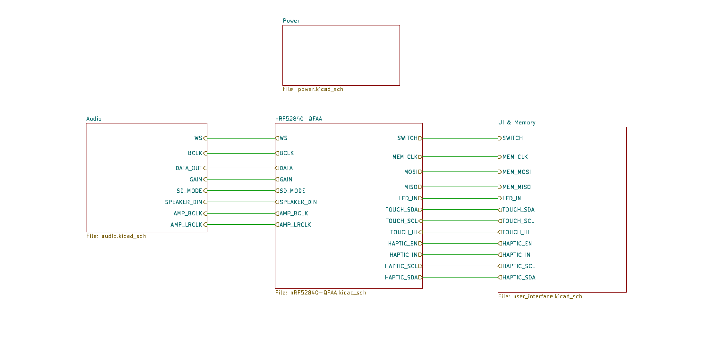
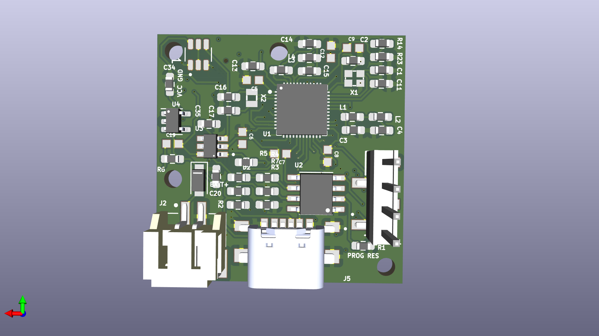

# AI Necklace - Wearable Voice Assistant

A compact, Bluetooth-enabled wearable device that provides hands-free AI voice interaction in a pendant form factor.

## Overview

This project implements a voice-activated AI assistant necklace featuring onboard audio processing, wireless connectivity, and extended battery life. The device can pair with external earpieces (AirPods, headphones) or use its built-in speaker for AI responses.

## Hardware Specifications

### Core Components

**Microcontroller:** Nordic nRF52840-QFAA (Bluetooth 5.0 LE)[^2]

**Audio Subsystem:**

- Microphone: SPH0645LM4H-B MEMS digital microphone[^1][^2]
- Speaker: CMS-15113-0785-67[^2]
- Audio Amplifier: MAX98357AETE+T I2S Class D amplifier[^2]

**Power Management:**

- Battery Charger: TP4056 (USB-C charging)[^2]
- Battery Protection: DW01A + FS8205 MOSFET[^2]
- Voltage Regulator: MIC5205-3.3YM5 LDO[^2]
- Expected battery: Rechargeable Li-ion (target 1-2 weeks moderate use)[^1]

**User Interface:**

- Tactile switch (B3U-1000P)[^2]
- Dual LED indicators (Red/Green)[^2]
- WS2812B RGB LED[^2]
- CY8CMBR3116 capacitive touch sensor[^2]
- DRV2605L haptic motor driver[^2]

**Memory:** W25Q16JVSSIQ 16Mbit SPI Flash[^2]

## Schematic Architecture

The design is organized into hierarchical sheets:

- `nRF52840-QFAA.kicad_sch` - Main microcontroller
- `power.kicad_sch` - Battery charging and power regulation
- `audio.kicad_sch` - Microphone and speaker circuitry
- `user_interface.kicad_sch` - Buttons, LEDs, touch, and haptics[^2]

## Pin Configuration

Key peripheral interfaces:

- **I2S Audio:** BCLK, LRCLK, DIN, DOUT pins
- **SPI Flash:** CLK, MOSI, MISO, CS
- **I2C Touch/Haptic:** SDA, SCL
- **Programming:** SWDIO, SWDCLK[^2]

## schematics

## pcb - top

## pcb - bottom

## 3d - top

## 3d - bottom

